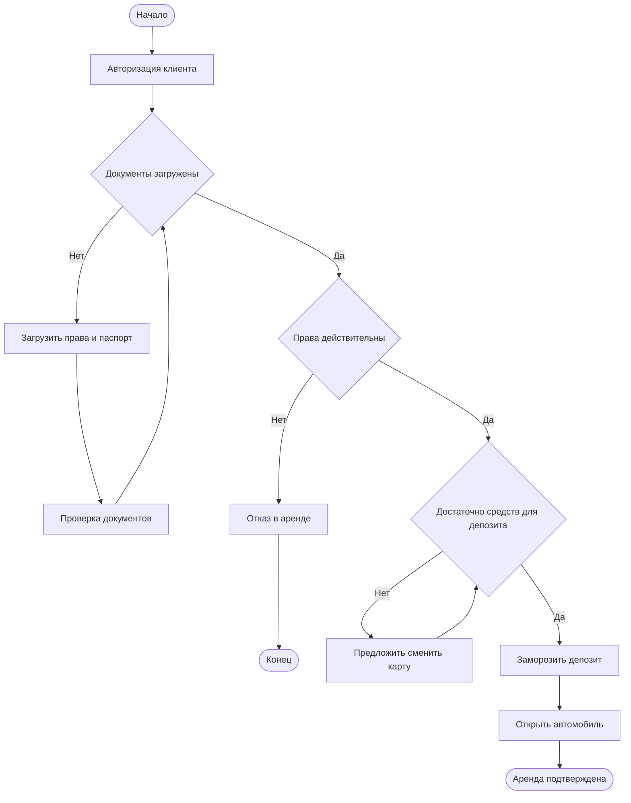

# Flowchart — Проверка клиента перед арендой

```mermaid
flowchart TD
    A([Начало]) --> B[Авторизация клиента]
    B --> C{Документы загружены}
    C -->|Нет| D[Загрузить права и паспорт]
    D --> E[Проверка документов]
    E --> C
    C -->|Да| F{Права действительны}
    F -->|Нет| G[Отказ в аренде]
    G --> H([Конец])
    F -->|Да| I{Достаточно средств для депозита}
    I -->|Нет| J[Предложить сменить карту]
    J --> I
    I -->|Да| K[Заморозить депозит]
    K --> L[Открыть автомобиль]
    L --> M([Аренда подтверждена])
```